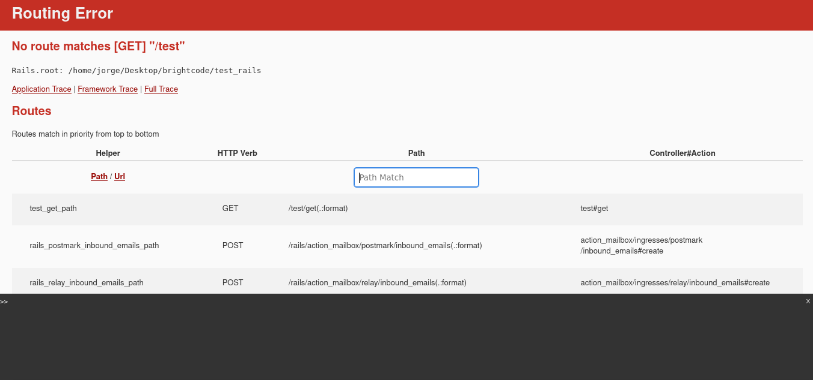
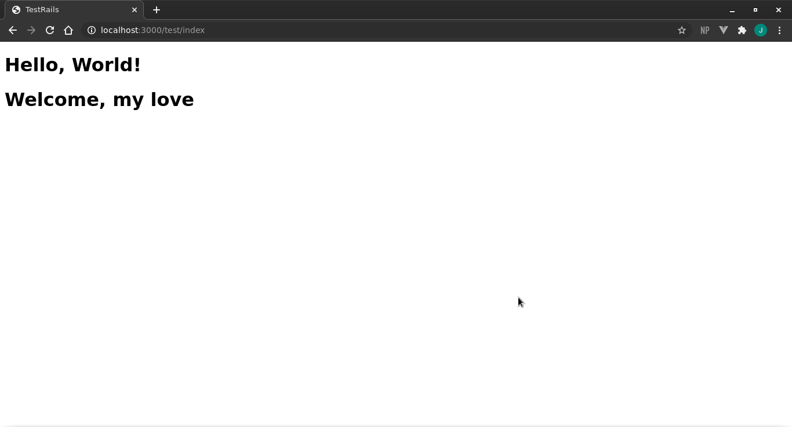

# Today I Learned by *Jorge Garcia*

[This Github Page is here](https://jorge27.github.io)

Ruby and Rails official documentation reading personal journal

## Week 1

### Thu 23, July 2020 *[Get started with ruby]*
Today, I read about how to install rails, the classic "Get started", it's really easy!, after I read it, I installed it by my own, I did two practices, using bundler and rails gem

***By Bunder***

First, create my `Gemfile` with
```sh
$ bundle init 
```
After this, a `Gemfile` is regularly created with the next lines
```sh
1   # frozen_string_literal: true
2
3   source "https://rubygems.com"
4   
5   git_source(:github) { |repo_name| "https://github.com/#{repo_name}" }   
6   
7   # gem "rails"
...
```
I only uncomment the line `7` and run

```sh
$ bundle install
```
After this, ruby downloaded many gems, but rails was not install yet. To finish I executed
```sh
$ bundle exec rails new .
```
And it's done, rails created some files, those files are the skeleton for our app

***By rails***

For install by gem `rails`, I only executed
```sh
$ rails new app
```
And create the files in the folder `app`

## Week 2

### Mon 27, July 2020 *[How works the controllers?]*
Rais is a MVC framework, which means that is composed by three principles elements, Models, Views and Controllers. Today i read about controllers, how create them.
When framework is used, we create some files for use like the controllers,we dont know if the files create affect how framework works. For this purpose, some frameworks have integrated tools for created yours elements.
Rails Generator create many elements, like models, assets and controllers, in this case, I will generate a controller. How I'm using `bundle gem`, when I want to generate a controller, after opening the working directory in the console, i execute
```sh
$ bundle exec rails generate controller Test
```
After this, the console show a list with the files created and modified, like see in the next image


In addition to our controller, also are create a view folder in `app/views/test`, a test file in `test/controllers/test_controller_test.rb`, a sass file in `app/assets/stylesheets/test.scss`, and an helper class in `app/helpers/test_helper.rb`. This extra files I will explain them in a future.
When our controller are created, our file is in `app/controllers` named `test_controller.rb` looks like:

```sh
1   class TestController < ApplicationController
2   end
3   
```
And it's done our controller are created. But for now, it does nothing. we will continue working with this file, in a future entrances.

### Tuesday 28, July 2020 *[How works the controllers?, part 2]*
Yesterday, I learned how create a controller in rais, but, controller does nothing, today I learned how use a controller.
First, when I write a url in the browser, this is call to our controller, the controller process our data and send to view for show in browser. 
With our controller create yesterday, we must register it in file `config/routes.rb` to be able to use our controller, write the next lines in `routes` file
```sh
1   Rails.application.routes.draw do
2     get 'test/index'
3   ...
```
After this, in our console, we write
```sh
$   bundle exec rails server
```
And now, we go to our browser and write the url `localhost:3000/test`, the browser most show some like:


And it is done, our controller is registered, but still need to create the views for show something

### Thursday 30, July 2020 *[My first view]*
When we created our controller using the console, some files were created, among these was created a folder in `app/views` directory. This folder will contains our `html` and `erb` files.
In the last entry, we registered the `test` controller in the `config/routes.rb` file, when the controller was registered, we only registered a `GET HTTP` request, this means that when we write a URL, the browser will execute a request , in this case a `GET HTTP` request, after this the framework search in our routes file and if a match is found it returns the data recorded inside the method in the controller.
Now, for see how this works, only we create a file in `app/views/test` named `index.html.erb` and write
```sh
1   <h1>Hello, World!</h1>
```
We must make sure that, the server rails is running, if that is not the case, go to the console and change to the work directory, an then execute
```sh
$   bundle exec rails server
```
After this we go to our browser and write `localhost:3000/test/index`, and should see the next

And it's done, our view are created!

### Friday 31, July 2020 *[My first view, passing data from controller to view]*
Today we learned how pass data from controller to view, this is very helpful as the controller can process information from the backend and present the information processed to present it to the view so that the user doesnt have process it by himself or doesn't not see the process in case that is require it.
In fact, to send data to the view only need be initialized the variable in the corespondient method, and how is the ruby style, the last variable declaration will containt the data to render in the view.
In the last post, we created a `app/views/test/index.html.erb` file, well, today it will update, I added the line `<h1><% = @hello %>, <% = @world %></h1>`, to the file and now it will look like
```sh
1   <h1>Hello, World!</h1>
2   <h1><%= @hello %>, <%= @world %></h1>
```
Up to this point, our view shows nothing new, because our controller is not updated add the lines '3' and '4' as seen below
```sh
1   class TestController < ApplicationController
2   	def index
3   		@hello = 'Welcome'
4   		@world = 'my love'
5   	end
6   end
7   
```
Now update the browser and our view show the bellow

## Week 3

### Tuesday 4, August 2020 *[Migrations]*
When developing a software, it is normally needed a database upgrade, in orden to add tables or fields or change the data type for the felds that we are going to add, etc. Also, when use migrations not need to know many syntaxis of the database controllers.
The migrations are normally part of an ORM (object-relational mapping) of the database. This makes our work easier because we don't need to use a diferent sintaxis for the different database controllers exisisting, instead migrations, translate our code in orden to create the necessary queries to the database.
Something that is pretty important to emphasize is when use of migrations we can versioned our database with git or svn.